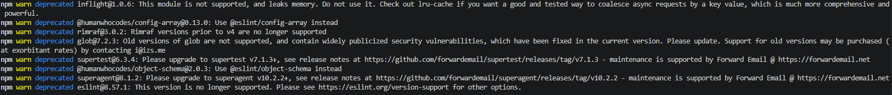

## Mathis Michenaud  - Compte rendu 

# Intro 

Les variables d'environnements suivantes sont nécessaires, cela concerne les donneés critiques qui ne doivent pas être push ni être rendu publiques
PORT=3000
POSTGRES_DB= ...
POSTGRES_USER= ...
POSTGRES_PASSWORD= ...
DATABASE_URL= ...
JWT_SECRET= ...
JWT_EXPIRES_IN= ..

On retrouve la base de donnée postgres, l'api, les commandes (`scripts`) et dépendances nécessaires dans le `package.json` qui sont vulnérables/dépréciées d'ailleurs. 

`
"scripts": {
    "start": "node src/server.js",
    "dev": "node --watch src/server.js",
    "test": "jest",
    "test:coverage": "jest --coverage",
    "lint": "eslint src/"
  },
  ` 

Dans le code il y a plusieurs problèmes de sécurités notamment :
 - Les requetes SQL qui ne sont pas protégées par l'injection  (ex : `await pool.query(`SELECT * FROM tasks WHERE status = '${status}'`);`)
 - Données non validées côté entrée (body, query, params)
 - Logs avec des informations sensibles (ex : `console.log('Default user created — username: admin, password: admin123');`)
 - Tous les utilisateurs peuvent supprimer n'importe quelle tâche
 - Cors permisif : `app.use(cors());` au lieu de bloquer
 - On log des informations "trop interne" : `res.status(err.status || 500).json({ error: err.message });`

# Gestion des secret 

## Analyse du problème
Un secret est une information sensible pour sécuriser l’app (JWT_SECRET, mots de passe, clés API).  

On doit pas le commiter car il y a une fuite possible, il est dans l'historique git et quelqu"un de malveillant peut avoir accès a ces donées.

On peut  chercher dans l’historique pour accéder au secrets qui auraient été commités, apres il doit y avoir des outils pour cela     

Supprimer le .env ne sert a rien si dans l'historique on voit toujours le .env avec les données sensibles.

## Solutions à identifier et comparer

- **Variables d'environnement système**  
  - **Fonctionnement** : définies directement sur le serveur ou la machine.  
  - **Avantages** : pas stockées dans le code et simples à utiliser.  
  - **Limitations** : difficiles à versionner  c'est unique à la machine 
  - **Usage adapté** : petits projets, scripts locaux, serveurs simples.

- **Fichiers `.env` avec `.gitignore` strict**  
  - **Fonctionnement** : fichier local chargé via `dotenv`.  
  - **Avantages** : facile à faire
  - **Limitations** : pas sécurisé si on push dans git 
  - **Usage adapté** : dev local, petits projets.

- **Secrets GitHub Actions (CI/CD)**  
  - **Fonctionnement** : secrets stockés dans le dépôt GitHub que l'on peut utilisé dans les workflows  
  - **Avantages** : Utilisé dans les CI/CD
  - **Limitations** :que dans les CI/CD GitHub Actions.  
  - **Usage adapté** : pour automatisé les déploiement

- **Gestionnaires de secrets cloud (AWS Secrets Manager, GCP Secret Manager)**  
  - **Fonctionnement** : services cloud pour stocker et fournir des secrets via API.  
  - **Avantages** : refresh des tokens, chiffrement, dans le cloud.  
  - **Limitations** : si AWS tombe c'est compliqué et cela peut etre payant.  
  - **Usage adapté** : applications cloud

Pour la suite je connaissais pas ducoup j'ai cherché sur internet et j'ai demandé à GPT :
- **SOPS (Secrets OPerationS) avec chiffrement**  
  - **Fonctionnement** : fichiers YAML/JSON/ENV chiffrés avec clés GPG/KMS.  
  - **Avantages** : versionnable, chiffré dans Git, multi-cloud support.  
  - **Limitations** : nécessite gestion des clés, complexité.  
  - **Usage adapté** : projets collaboratifs, infra-as-code, multi-env.

- **HashiCorp Vault**  
  - **Fonctionnement** : serveur centralisé pour gérer et distribuer secrets dynamiques.  
  - **Avantages** : rotation automatique, audit, contrôle d’accès fin.  
  - **Limitations** : déploiement et maintenance complexes.  
  - **Usage adapté** : grandes équipes, microservices, infra critique.
