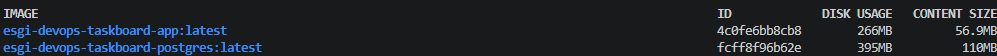
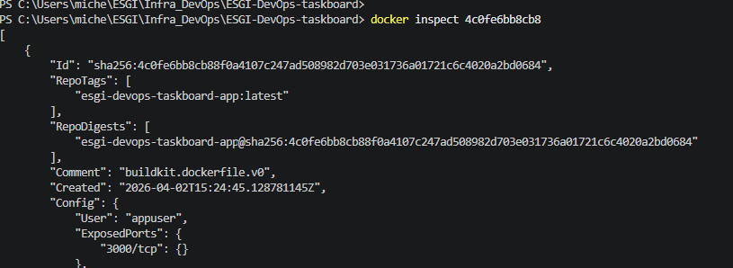
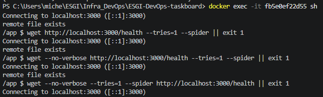
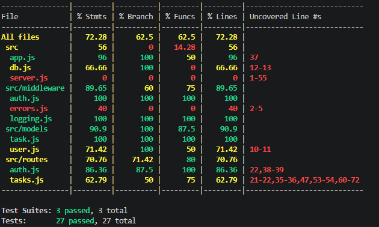

## Mathis Michenaud  - Compte rendu 


# Intro 

Les variables d'environnements suivantes sont nécessaires, cela concerne les donneés critiques qui ne doivent pas être push ni être rendu publiques
PORT=3000
POSTGRES_DB= ...
POSTGRES_USER= ...
POSTGRES_PASSWORD= ...
DATABASE_URL= ...
JWT_SECRET= ...
JWT_EXPIRES_IN= ..

On retrouve la base de donnée postgres, l'api, les commandes (`scripts`) et dépendances nécessaires dans le `package.json` qui sont vulnérables/dépréciées d'ailleurs. 

`
"scripts": {
    "start": "node src/server.js",
    "dev": "node --watch src/server.js",
    "test": "jest",
    "test:coverage": "jest --coverage",
    "lint": "eslint src/"
  },
  ` 


Dans le code il y a plusieurs problèmes de sécurités notamment :
 - Les requetes SQL qui ne sont pas protégées par l'injection  (ex : `await pool.query(`SELECT * FROM tasks WHERE status = '${status}'`);`)
 - Données non validées côté entrée (body, query, params)
 - Logs avec des informations sensibles (ex : `console.log('Default user created — username: admin, password: admin123');`)
 - Tous les utilisateurs peuvent supprimer n'importe quelle tâche
 - Cors permisif : `app.use(cors());` au lieu de bloquer
 - On log des informations "trop interne" : `res.status(err.status || 500).json({ error: err.message });`


# 1 - Gestion des secret 

## Analyse du problème
Un secret est une information sensible pour sécuriser l’app (JWT_SECRET, mots de passe, clés API).  

On doit pas le commiter car il y a une fuite possible, il est dans l'historique git et quelqu"un de malveillant peut avoir accès a ces donées.

On peut  chercher dans l’historique pour accéder au secrets qui auraient été commités, apres il doit y avoir des outils pour cela     

Supprimer le .env ne sert a rien si dans l'historique on voit toujours le .env avec les données sensibles.

## Solutions à identifier et comparer

- **Variables d'environnement système**  
  - **Fonctionnement** : définies directement sur le serveur ou la machine.  
  - **Avantages** : pas stockées dans le code et simples à utiliser.  
  - **Limitations** : difficiles à versionner  c'est unique à la machine 
  - **Usage adapté** : petits projets, scripts locaux, serveurs simples.

- **Fichiers `.env` avec `.gitignore` strict**  
  - **Fonctionnement** : fichier local chargé via `dotenv`.  
  - **Avantages** : facile à faire
  - **Limitations** : pas sécurisé si on push dans git 
  - **Usage adapté** : dev local, petits projets.

- **Secrets GitHub Actions (CI/CD)**  
  - **Fonctionnement** : secrets stockés dans le dépôt GitHub que l'on peut utilisé dans les workflows  
  - **Avantages** : Utilisé dans les CI/CD
  - **Limitations** :que dans les CI/CD GitHub Actions.  
  - **Usage adapté** : pour automatisé les déploiement

- **Gestionnaires de secrets cloud (AWS Secrets Manager, GCP Secret Manager)**  
  - **Fonctionnement** : services cloud pour stocker et fournir des secrets via API.  
  - **Avantages** : refresh des tokens, chiffrement, dans le cloud.  
  - **Limitations** : si AWS tombe c'est compliqué et cela peut etre payant.  
  - **Usage adapté** : applications cloud


Pour la suite je connaissais pas ducoup j'ai cherché sur internet et j'ai demandé à GPT :
- **SOPS (Secrets OPerationS) avec chiffrement**  
  - **Fonctionnement** : fichiers YAML/JSON/ENV chiffrés avec clés GPG/KMS.  
  - **Avantages** : versionnable, chiffré dans Git, multi-cloud support.  
  - **Limitations** : nécessite gestion des clés, complexité.  
  - **Usage adapté** : projets collaboratifs, infra-as-code, multi-env.

- **HashiCorp Vault**  
  - **Fonctionnement** : serveur centralisé pour gérer et distribuer secrets dynamiques.  
  - **Avantages** : rotation automatique, audit, contrôle d’accès fin.  
  - **Limitations** : déploiement et maintenance complexes.  
  - **Usage adapté** : grandes équipes, microservices, infra critique.


# 2 - Conteneurisation 

## Pourquoi conteneuriser une application Node.js ?

Isolation complète du runtime et des dépendances
Reproductibilité sur toutes les environnements (dev, test, prod)
Déploiement simplifié et scalabilité avec orchestrateurs comme Docker Compose ou Kubernetes

## Qu'est-ce que le concept de « build reproductible » et pourquoi est-il important ?

C’est un build dont le résultat est identique quel que soit l’environnement ou le moment.
Important pour traçabilité, CI/CD, et sécurité (aucune surprise dans les dépendances ou fichiers générés).

## Quelle est la différence entre une image de développement et une image de production ?


| Caractéristique |	Dev | Prod | 
|-----------------|-----|------|
|Taille	| Légère moins prioritaire	| Optimisée |
|Outils inclus	| Node/npm, debugger, live reload	| Juste runtime |
|Dépendances | 	Dev + prod	| Prod uniquement |
|Variables d’environnement |	Débogage activé	| Secrets sécurisés |


## Solutions à identifier et comparer

### Choix de l’image de base Node.js :

- node:20 → complète, grande, pratique pour dev
- node:20-alpine → plus légère, bonne pour prod, mais certains packages natifs peuvent poser problème
- node:20-slim → compromis sécurité/taille
- gcr.io/distroless/nodejs20 → très sécurisée, pas de shell, minimaliste, parfaite pour prod

### Stratégie de build :

- Single-stage : simple mais image plus lourde
- Multi-stage : compile/build dans une étape, runtime minimal dans l’autre → image plus légère et sécurisée avec les fichiers strictmenent nécesssaire

### Sécurité :

- Ne pas exécuter le conteneur en root, créer un utilisateur dédié
- Mettre le système de fichiers en lecture seule si possible
- Ajouter HEALTHCHECK pour vérifier la disponibilité du service
- Épingler les versions (node:20-alpine, postgres:16-alpine)

### Gestion des dépendances Node :

- npm ci pour des builds reproductibles
- Exclure les devDependencies dans l’image de production
- Utiliser le cache Docker pour éviter de réinstaller inutilement


## Mise en place

La taille de l'image est < 300Mo


On est pas en root : 


Le conteneur est visiblement healthy 



# 3 - Tests automatisés


## Pyramide des tests et types de tests

###  Qu'est-ce que la pyramide des tests ?
La **pyramide des tests** c'est une représentation des différents types de tests dans une application.

1. **Tests unitaires (base)**  
   - Très nombreux  
   - Rapides à exécuter  
   - Testent une fonction ou une classe isolée  

2. **Tests d'intégration (milieu)**  
   - Moins nombreux  
   - Testent l'interaction entre plusieurs composants  
   - Exemple : service + base de données  

3. **Tests end-to-end (sommet)**  
   - Peu nombreux  
   - Lents et plus coûteux  
   - Simulent un scénario utilisateur complet  


### Différence entre test unitaire, intégration et end-to-end

Test unitaire
- Teste du code spécifique (fonction)
- Dépendances mockées

Test d'intégration
- Teste les interractions entre plusieurs classes/modules
- On peut utiliser une vraie base de données ou API

Test End-to-End (E2E)
- Tests de bout en bout comme en utilisation rééelle (complétion de formulaire, cliquer sur un bouton etc)

## Couverture de code

### Qu'est-ce que la couverture de code ? Est-ce suffisant pour juger la qualité ?

La couverture de code (code coverage) mesure le pourcentage du code exécuté par les tests.
Cela ne garantit pas que le code est correct.
Les tests peuvent être mal écris ou non complets (cas limites non fait etc)


## Tester une API REST 

### Comment tester une API REST ? Quels outils existent pour ça ?

Tester une API REST consiste à vérifier :
- les **codes de retour HTTP** (200, 404, 500…)
- la **structure des réponses JSON**
- les **données retournées**
- l’**authentification**
- la **gestion des erreurs**


Outils courants
- **Manuels** : Postman, curl  
- **Automatisés** : Jest + Supertest, Pytest, JUnit + RestAssured  
- **E2E** : Newman, Karate, Cypress


## Exploration de l'existant

```bash
npm test
npm run test:coverage
npm run lint
```

Les méthodes basiques `findAll`, `findById`, `create` et `delete` des tasks sont testées.
Cependant, certaines routes comme `PUT /tasks/:id` et `DELETE /tasks/:id` ne sont pas testées, entre autres.
Il manque également des tests sur les cas limites, comme la validation des inputs (paramètre vide, statut invalide, injection).
Les middleware ne sont pas testés, tout comme la gestion du JWT et, plus généralement, l’authentification.

### Tests : Avant vs Après

| Métrique        | Avant   | Après   |
|----------------|--------|--------|
| **Tests**      | 16     | 27     |
| **Statements** | 63.85% | 72.28% |
| **Branches**   | 53.12% | 62.5%  |
| **Functions**  | 50%    | 62.5%  |
| **Lines**      | 63.85% | 72.28% |


### Tests supplémentaires ajoutés
J'ai réalisé les trois types de tests afin de couvrir les trois niveaux de test (TU, TI, E2E). Bien évidemment, d'autres tests sont plus importants, comme la vérification des droits de modification ou encore la validation des entrées, car ce sont des points sensibles de l'application.

1. **`PUT /tasks/:id`** (intégration) - Mise à jour de tâche 
2. **`Task.findByStatus()`** (unitaire) - Filtrage par status
3. **`auth.js`** (middleware) - Teste la validité du token (tres important) 





# 4 - Pipeline CI : intégration continue

## CI / CD —Analyse du problème

### 1 - Quelle est la différence entre CI (Intégration Continue) et CD (Déploiement Continu) ?

- **CI (Intégration Continue)** : à chaque push, on automatise les étapes de vérification (tests, lint, build). (Vérification)
- **CD (Déploiement Continu)** : on automatise la mise en production après validation des tests. (Livraison)


### 2 - Qu'est-ce qu'un runner GitHub Actions ? Où s'exécute-t-il ?

Un **runner GitHub Actions** est une machine qui exécute les workflows (tests, build, etc..).

- Il peut être **hébergé par GitHub** dans le cloud ou **auto-hébergé** sur ma machine par exemple
- Il exécute les jobs dans un environnement isolé (Linux, Windows, etc.)


### 3 - Qu'est-ce qu'un artefact de pipeline ? Dans quels cas est-il utile ?

Un **artefact** est un fichier généré par un job et conservé pour plus tard.
Cela peut être une image DOcker, un client typeScript généré à partir du code (build) ou encore des résultats de tests


### 4 - Comment les jobs peuvent-ils dépendre les uns des autres ?
Les jobs peuvent s’enchaîner grâce au `needs` dans le fichier `yml`.
Cela indique si la pjhase de job doit se lancer ou non.

Exemple :
- Job 1 : tests
- Job 2 : build (si tests OK)
- Job 3 : déploiement (si build OK)


## Comparaison des outils CI/CD et registries Docker

###  Solution à identifier et comparer

| Critère | GitHub Actions | GitLab CI | CircleCI |
|----------|---------------|------------|-----------|
| **Prix (public)** | Gratuit | Gratuit | Gratuit limité |
| **Syntaxe** | YAML simple | YAML puissant | YAML + config avancée |
| **Écosystème** | Très riche (marketplace d’actions) | Intégré à GitLab | Bon mais plus limité |
| **Courbe d’apprentissage** | Facile | Moyenne | Moyenne à difficile |


- **GitHub Actions** : le plus simple et intégré à GitHub → idéal pour ce TP
- **GitLab CI** : très puissant mais plus complexe
- **CircleCI** : performant mais moins intégré à l’écosystème GitHub

Pour ce TP **GitHub Actions est le plus pertinent** car c'est le plus simple à utiliser et il existe pas mal d'action prêt à l'emploi.

---

## Comparaison des Docker Registries

### GitHub Container Registry (GHCR)
- Intégré à GitHub
- Gestion des permissions via GitHub

### Docker Hub
- Le plus connu
- Facile à utiliser
- Moins intégré aux workflows GitHub mais ducoup séparé de github

### Amazon ECR / GCP Artifact Registry
- Très robuste (cloud enterprise)
- Payant et plus complexe
- Idéal pour production cloud


### Conclusion 

GitHub Container Registry (GHCR) est le mieux à utiliser dans notre contexte car il est déjà intégré à GitHub Actions. Il est gratuit et simple à utiliser.


# 5 — Déploiement local via SSH


## Analyse du problème 


### 1 - Comment GitHub Actions peut-il se connecter à une machine locale derrière un NAT ?

GitHub Actions ne peut pas accéder directement à une machine derrière un NAT, car celle-ci n’est pas exposée sur Internet. On utilise donc des **connexions sortantes** :

- **Self-hosted runner** : la machine locale exécute un agent GitHub Actions et se connecte elle-même à GitHub.
- **Tunnel sortant (SSH, VPN, ngrok, cloudflared)** : la machine ouvre un canal vers un serveur public.
- **Reverse SSH tunnel** : redirection d’un port local vers une machine distante via une connexion sortante.


### 2 -  Qu'est-ce qu'un tunnel SSH ? Comment fonctionne le port forwarding inversé (`-R`) ?

Un **tunnel SSH** transporte du trafic réseau à travers une connexion SSH chiffrée.

#### Port forwarding inversé (`-R`)
Permet d’exposer un service local vers une machine distante.

```bash
ssh -R 8080:localhost:3000 user@serveur
```
- Le serveur distant écoute sur 8080
- Le trafic est redirigé vers localhost:3000 sur la machine locale

### 3 - Qu'est-ce qu'un déploiement idempotent ? Pourquoi est-ce important ?

Un déploiement idempotent produit toujours le même état final, même s’il est exécuté plusieurs fois.

Exemple :
 - OK : vérifier avant installation
 - KO : réinstaller sans contrôle → effets de bord

Importance :
 - évite les incohérences d’état
 - rend les déploiements reproductibles
 - permet de relancer sans risque
 - facilite CI/CD et automatisation

### 4 - Qu'est-ce qu'un healthcheck post-déploiement ? Que doit-il vérifier ?

Un healthcheck post-déploiement vérifie automatiquement que l’application fonctionne après mise en production.

Il doit contrôler :
 - disponibilité du service (/health)
 - temps de réponse acceptable
 - dépendances (DB, cache, API externes)
 - absence d’erreurs critiques au démarrage
 - exécution basique d’une requête fonctionnelle

Objectif :
 - détecter rapidement un déploiement cassé
 - déclencher un rollback si nécessaire
 - garantir la stabilité du service


## Solutions à identifier et comparer


### Outils de tunnel SSH

Comparaison des principales solutions pour exposer un service local derrière NAT en TP.

#### ngrok (tier gratuit)

- Installation : nécessaire (binaire + compte)
- Fonctionnement : tunnel via client local vers infrastructure cloud
- URL : aléatoire sur la version gratuite
- Durée de session : limitée (sessions non garanties stables sur free tier)
- Compte : obligatoire
- Fiabilité : élevée (infrastructure mature)
- Contraintes :
  - quotas/bande passante
  - restrictions sur le plan gratuit
  - dépendance forte au service externe

==>  Très simple mais limité pour usage gratuit prolongé.

#### localhost.run

- Installation : aucune (SSH natif uniquement)
- Fonctionnement : tunnel SSH inversé public
- URL : généralement change à chaque connexion
- Durée de session : non garantie (usage “éphémère”)
- Compte : non requis
- Fiabilité : correcte mais variable (service communautaire)
- Contraintes :
  - peu de fonctionnalités avancées
  - pas de dashboard ni monitoring
  - uniquement HTTP/HTTPS

==> Très pratique pour tests rapides sans installation 


#### Cloudflare Tunnel (cloudflared)

- Installation : client `cloudflared`
- Fonctionnement : tunnel sortant vers Cloudflare edge
- URL : stable si configuré avec domaine Cloudflare
- Durée de session : stable et persistante
- Compte : requis (Cloudflare)
- Fiabilité : très élevée (infrastructure Cloudflare)
- Contraintes :
  - configuration initiale plus complexe
  - nécessite gestion DNS (souvent via Cloudflare)
  - dépendance à un écosystème cloud

==> Solution la plus robuste et pro

#### Pinggy

- Installation : aucune ou très légère (commande SSH)
- Fonctionnement : tunnel SSH simplifié vers service cloud
- URL : dynamique (selon session)
- Durée de session : variable selon plan
- Compte : optionnel ou léger selon usage
- Fiabilité : bonne
- Contraintes :
  - certaines fonctions payantes
  - limites sur usage gratuit
  - moins standard que Cloudflare/ngrok

==> Bon compromis simplicité / fonctionnalités

#### serveo.net

- Installation : aucune (SSH uniquement)
- Fonctionnement : reverse SSH tunnel public
- URL : change à chaque session (sauf sous-domaines demandés)
- Durée de session : non garantie
- Compte : non requis
- Fiabilité : faible à moyenne (service connu pour instabilité)
- Contraintes :
  - service parfois indisponible
  - pas de SLA
  - peu de fonctionnalités

==> Solution historique mais peu fiable aujourd’hui :contentReference[oaicite:3]{index=3}

### Synthèse comparative (TP)

#### Solutions les plus adaptées en TP
- Cloudflare Tunnel → le plus stable et professionnel
- localhost.run → le plus simple sans installation
- ngrok → le plus pédagogique mais limité en gratuit

#### Solutions plus “light / rapides”
- Pinggy → bon équilibre simplicité / fonctionnalités
- serveo → uniquement pour tests rapides non critiques


## Conclusion

- **Stabilité / production-like** → Cloudflare Tunnel  
- **Simplicité extrême** → localhost.run ou SSH natif  
- **Usage pédagogique classique** → ngrok  
- **Tests rapides jetables** → serveo / Pinggy  

Ici en TP on a juste besoin de quelque chose de rapide pour pouvoir tester


<br>

Pour le reste du déploiement, j'ai des permission refused. J'ai essayé avec localhost.run mais cela fonctionne pas il me donne pas l'url a mettre dans les secret pour le TUNNEL_HOST.